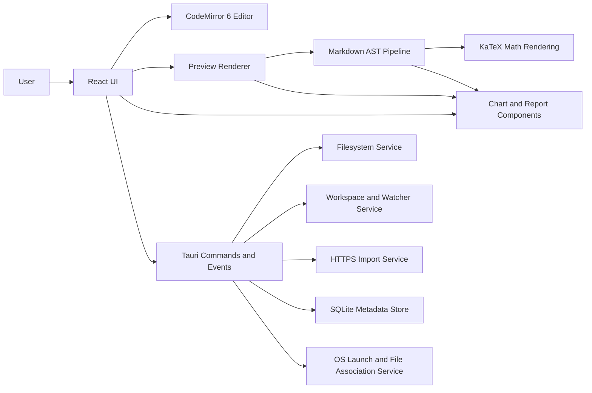

# Simple MD

Draft product and technical specification

Version: 0.1
Date: 2026-05-07
Status: Working draft
Authoring context: Initial greenfield specification for a standalone desktop Markdown editor built with Tauri for macOS, Windows, and Linux.

## 1. Executive summary

Simple MD is a local-first desktop Markdown editor designed to make Markdown feel powerful without feeling technical. It should be excellent at writing, reading, organizing, and opening `.md` files directly from the filesystem, while adding a few high-value improvements that many editors either overcomplicate or underdeliver:

- excellent Markdown source editing
- excellent rendered reading experience
- a true hybrid mode that edits Markdown while visually rendering it
- first-class math support with inline and block LaTeX
- built-in data visualization through inline chart blocks and structured report rendering
- folder-based note organization that respects the real filesystem
- OS-level file association support so the app can act as the user's default Markdown editor
- secure HTTPS import of remote Markdown from user-provided URLs

The product should feel fast, calm, dependable, and local-first. It should not force a database-backed note system, a cloud account, or a proprietary storage model. The filesystem remains the source of truth for document content.

## 2. Product vision

### 2.1 Vision statement

Build the best everyday Markdown editor for people who want clean local files, strong rendering fidelity, lightweight organization, and math-friendly writing without the complexity of a wiki or IDE.

### 2.2 Product promise

Simple MD should let a user:

- open a folder of Markdown files and work immediately
- switch between writing, reading, and hybrid composition without changing apps
- trust that the app will not trap content in a proprietary format
- write math naturally with LaTeX syntax and see it render correctly
- embed charts directly in Markdown documents and view them as native visualizations
- open Markdown files from the OS like any native editor
- pull in remote Markdown over HTTPS without needing separate tooling

### 2.3 Design principles

- Local first: user files live on disk in normal folders.
- Native-feeling: file dialogs, file associations, menu behavior, and shortcuts should match platform expectations.
- Low ceremony: the app should be usable in under two minutes after install.
- WYSIWYM over WYSIWYG: preserve Markdown as the underlying authoring format.
- Safe by default: sanitize preview HTML, restrict dangerous operations, and keep network activity explicit.
- Fast at scale: ordinary notes should feel instant; large notes should degrade gracefully rather than freeze.

## 3. Problem statement

Many Markdown editors split into two unsatisfying camps:

- developer-first editors that are powerful but visually noisy and awkward for reading
- note-taking apps that feel smooth but hide or distort the underlying filesystem

Users who keep Markdown files in folders often want:

- a native editor better than a plain text area
- preview fidelity better than a browser tab
- math support beyond plain text editing
- a workflow that works directly on local files, project docs, personal notes, lab notes, and documentation folders

Simple MD should fill that gap.

## 4. Goals and non-goals

### 4.1 Product goals

1. Provide high-quality Markdown editing and rendering for local files.
2. Make folder-based organization a first-class experience rather than an afterthought.
3. Make math writing feel native, not bolted on.
4. Support three distinct user modes: source editing, rendered reading, and hybrid composition.
5. Integrate with the operating system so Markdown files can open directly in the app.
6. Import Markdown from remote HTTPS URLs with a safe and understandable workflow.
7. Remain local-first and avoid locking users into an app-specific format.

### 4.2 Non-goals for v1

- real-time multiplayer collaboration
- built-in Git hosting or pull request review workflows
- cloud sync or required accounts
- rich-text proprietary storage
- mobile apps
- plugin marketplace
- full static site generation
- arbitrary HTML page to Markdown conversion as a primary workflow
- acting as a general-purpose text editor for every plain text format

### 4.3 Stretch goals after v1

- document outline and heading quick-jump
- full-text search across workspace roots
- export to PDF and HTML
- image paste/drop asset management
- command palette
- optional Vim keybindings
- optional markdown linting

## 5. Target users

### 5.1 Primary personas

#### Persona A: Technical writer

Needs:

- accurate Markdown preview
- filesystem-based project docs
- reliable links, code fences, tables, and frontmatter
- quick mode switching between writing and reading

#### Persona B: Student or researcher

Needs:

- inline and block math
- folder-based organization for courses or papers
- calm reading mode
- reliable local file ownership

#### Persona C: Developer who prefers lightweight tools

Needs:

- a simpler writing-focused tool than a full IDE
- easy opening of repo docs, notes, and scratch files
- file associations that work from Finder, Explorer, and Linux file managers

#### Persona D: Knowledge worker using plain files

Needs:

- easy note creation in folders
- minimal setup
- confidence that files stay usable outside the app

### 5.2 Secondary users

- educators
- documentation teams
- operations staff maintaining runbooks
- journal or PKM users who prefer folders over databases

## 6. Core use cases

1. Open a folder of Markdown files and browse them from a sidebar tree.
2. Create, rename, move, and delete Markdown files and folders inside a workspace root.
3. Open an individual `.md` file from the OS and edit it immediately.
4. Write Markdown in source mode with syntax highlighting and formatting aids.
5. Read a note in preview mode with polished typography and math rendering.
6. Use hybrid mode to edit Markdown while most constructs render visually in place.
7. Open a remote Markdown file from an HTTPS URL and save it locally if desired.
8. Embed a JSON-backed chart block in a Markdown document and see it render in preview and hybrid mode.
9. Re-open recent files and recent workspace folders quickly.
10. Recover safely from app crash or external file changes.

## 7. Product scope

### 7.1 Core entities

- Workspace root: a user-selected folder managed by the app.
- Folder: a real filesystem directory inside a workspace root.
- Note: a Markdown file, typically `.md`, inside a workspace root or opened standalone.
- Buffer: the in-memory editing state for an open note.
- Session: open tabs, selected mode, cursor positions, and unsaved draft snapshots.
- Chart block: a fenced `chart` code block containing a JSON chart specification inside Markdown.
- Structured report descriptor: optional app-native metadata pointing to a registered React report component and its props.
- Remote import: a note fetched from an HTTPS URL and opened as a temporary or saved file.

### 7.2 Source of truth

- Document content source of truth: filesystem Markdown files.
- App state source of truth: local app metadata store.
- Rendered output: derived from the Markdown source and never primary.

## 8. User experience specification

### 8.1 Product character

The UI should feel:

- calm
- readable
- intentionally minimal
- desktop-native rather than browser-like
- trustworthy around file operations

### 8.2 High-level layout

Default desktop layout:

- left sidebar: workspace roots, folder tree, recent files, optional outline
- center pane: editor or preview depending on mode
- top toolbar: mode switcher, file actions, URL import, search, save state
- optional bottom/status bar: path, word count, line/column, mode, encoding, math errors

### 8.3 Primary navigation

- File menu
- Edit menu
- View menu
- Workspace menu
- Help menu
- keyboard shortcuts
- drag and drop
- command search later, if added

### 8.4 Three editing modes

#### Mode 1: Text edit mode

Purpose:

- pure Markdown source editing

Behavior:

- single editable text pane
- Markdown syntax highlighting
- chart blocks remain editable as raw fenced JSON
- line numbers optional
- soft wrap optional
- active editing helpers such as list continuation, pair completion, and bracket matching

Best for:

- precise syntax work
- raw Markdown control
- power users

#### Mode 2: Read-only render mode

Purpose:

- distraction-light reading and review

Behavior:

- fully rendered Markdown
- math rendered
- chart blocks render as native charts
- links clickable
- code blocks highlighted
- no content editing
- scroll position persists

Best for:

- reading
- proofing
- presentations or sharing the screen

#### Mode 3: Hybrid edit-render mode

Purpose:

- single-pane composition where Markdown remains editable but most syntax is visually rendered when not actively being edited

Behavior:

- focused region shows raw Markdown text for direct editing
- unfocused rich regions render inline where practical
- headings, emphasis, links, checkboxes, inline math, block math, chart blocks, code fences, and blockquotes may render as styled widgets or decorated text
- cursoring into a rendered region reveals the underlying source
- the raw file content remains plain Markdown on disk

Best for:

- users who want Typora-like comfort without abandoning explicit Markdown

Key v1 constraint:

- hybrid mode must be reliable and understandable before it is ambitious; if a construct is hard to render inline without causing cursor bugs, source-mode behavior is preferable to brittle pseudo-WYSIWYG behavior

### 8.5 File and folder workflows

The app must support:

- add workspace root
- remove workspace root from app without deleting the folder
- create folder
- create note
- rename folder or note
- move folder or note by drag and drop
- duplicate note
- delete note or folder with confirmation when destructive
- reveal file in system file manager
- open containing folder

### 8.6 Standalone file workflows

The app must support opening:

- a single Markdown file without adding its parent folder as a workspace root
- multiple files from the OS or CLI
- a file by drag and drop onto the app window

### 8.7 Recent items

The app should show:

- recent files
- recent workspace roots
- recently imported URLs

### 8.8 Empty states

Important empty-state entry points:

- first launch
- no workspace selected
- no file open
- import failed
- folder contains no Markdown files

The first-launch state should guide users to:

- open a folder
- open a file
- create a note
- import from URL
- optionally set file associations

### 8.9 Visualization experience

Visualization should feel like a natural extension of Markdown authoring rather than a separate dashboard mode.

Recommended behavior:

- in text edit mode, chart blocks are visible and editable as ordinary fenced Markdown
- in preview mode, supported chart blocks render as responsive themed charts
- in hybrid mode, an unfocused chart block renders as a chart and becomes raw JSON when the user enters the block for editing
- charts should inherit app theme tokens for typography, color ramps, gridlines, and tooltip styling
- invalid chart specs should degrade gracefully to an error panel plus the original source content

## 9. Functional requirements

### 9.1 Markdown support

#### FR-MD-001

The app must parse and render CommonMark-compliant Markdown.

#### FR-MD-002

The app must support core GitHub Flavored Markdown constructs:

- tables
- task lists
- strikethrough
- autolinks
- fenced code blocks

#### FR-MD-003

The app should support:

- footnotes
- YAML frontmatter awareness
- heading anchors in preview

#### FR-MD-004

The app must preserve source fidelity. Opening and saving a file must not silently rewrite valid Markdown formatting unless the user explicitly triggers formatting or transforms.

#### FR-MD-005

The app must support UTF-8 files. Encoding fallback support for common legacy encodings is optional and may be deferred.

#### FR-MD-006

The app must render code fences with syntax highlighting for common languages.

#### FR-MD-007

The app should support safe inline HTML rendering in preview, subject to sanitization rules.

### 9.2 Editing experience

#### FR-ED-001

The app must support:

- undo and redo
- cut, copy, paste
- multi-line selection
- find
- replace
- go to line

#### FR-ED-002

The app must support desktop-standard shortcuts on each operating system.

#### FR-ED-003

The app must show dirty state for unsaved buffers.

#### FR-ED-004

The app must warn on close when unsaved changes exist unless autosave has already persisted them.

#### FR-ED-005

The app should support draft recovery snapshots even when autosave is disabled.

#### FR-ED-006

The editor should support large files with graceful degradation, especially in hybrid mode.

### 9.3 Math support

#### FR-MATH-001

The app must support inline LaTeX math delimited by `$...$`.

#### FR-MATH-002

The app must support block math delimited by `$$...$$`.

#### FR-MATH-003

The app should optionally support `\(...\)` and `\[...\]` delimiters for compatibility.

#### FR-MATH-004

Math must render in preview mode and hybrid mode.

#### FR-MATH-005

The app must show a non-destructive error state for invalid math rather than failing the entire document render.

#### FR-MATH-006

The app should allow user-defined KaTeX macro settings at the app level and optionally per-workspace later.

### 9.4 Folder system and workspace management

#### FR-FS-001

The app must allow one or more workspace roots.

#### FR-FS-002

The app must display a real folder tree for each workspace root.

#### FR-FS-003

The app must filter for Markdown files by default while still allowing users to view other related assets when useful.

#### FR-FS-004

The app must watch workspace roots for external file changes.

#### FR-FS-005

If a file changes externally and the buffer has no local edits, the app must reload it automatically or near-automatically with a subtle notice.

#### FR-FS-006

If a file changes externally and the buffer has unsaved local edits, the app must present a conflict resolution flow.

#### FR-FS-007

Deleting a file or folder from the app must delete the underlying filesystem item only after a clear confirmation step for destructive actions.

### 9.5 Default editor behavior and OS integration

#### FR-OS-001

The app must declare file associations for common Markdown file extensions.

Recommended default association list:

- `.md`
- `.markdown`
- `.mdown`
- `.mkd`

#### FR-OS-002

The app should not claim `.txt` by default in v1.

#### FR-OS-003

The app must be able to receive file-open requests from the OS and open the targeted file in the existing app instance when possible.

#### FR-OS-004

The app must support drag-and-drop file opening from the desktop shell into the window.

#### FR-OS-005

The app should provide a user-facing "Set as default Markdown editor" action or guided OS-specific flow, while acknowledging that some platforms require explicit user confirmation in system settings.

### 9.6 HTTPS import

#### FR-NET-001

The app must allow a user to paste an HTTPS URL and attempt to fetch Markdown content from it.

#### FR-NET-002

The app must follow redirects up to a bounded limit.

#### FR-NET-003

The app must reject non-HTTPS URLs in v1.

#### FR-NET-004

The app must detect whether the fetched resource is likely Markdown or text content before importing.

#### FR-NET-005

The app should support common provider URL normalization, especially for GitHub and similar repository hosts where user-facing page URLs are not the raw file URL.

#### FR-NET-006

The import workflow must give the user a clear choice to:

- open as temporary unsaved content
- save into a chosen folder
- cancel

#### FR-NET-007

The app must impose a size limit for direct v1 import to prevent accidental memory abuse. Recommended initial limit: 10 MB uncompressed.

#### FR-NET-008

The app should preserve source URL metadata in session state so preview can resolve relative links and images against the remote base URL while the imported note remains unsaved.

### 9.7 Session and recovery

#### FR-SES-001

The app should restore:

- open tabs
- selected tab
- cursor positions
- scroll positions
- active mode per tab where feasible

#### FR-SES-002

The app must store crash recovery drafts for dirty buffers in app-local storage.

#### FR-SES-003

On next launch after abnormal termination, the app must offer draft recovery.

### 9.8 Accessibility

#### FR-A11Y-001

The app must be fully keyboard navigable.

#### FR-A11Y-002

The app must provide accessible names and roles for major controls.

#### FR-A11Y-003

The app should support high-contrast themes and system zoom scaling.

#### FR-A11Y-004

The app should respect reduced-motion settings.

### 9.9 Data visualization

#### FR-VIZ-001

The app must detect fenced `chart` code blocks in Markdown and treat them as visualization blocks.

#### FR-VIZ-002

The chart block payload must be JSON in v1.

Illustrative example:

```chart
{
  "type": "bar",
  "title": "Team Headcount",
  "data": [
    { "name": "Q1", "value": 15 },
    { "name": "Q2", "value": 18 }
  ],
  "xKey": "name",
  "height": 300
}
```

#### FR-VIZ-003

The app must support at least these chart types in v1:

- bar
- line
- area
- pie

#### FR-VIZ-004

If a chart spec omits `series`, the renderer should auto-detect numeric data fields and assign theme-aware colors deterministically.

#### FR-VIZ-005

Chart blocks must render in preview mode and hybrid mode, while remaining raw editable Markdown in text edit mode.

#### FR-VIZ-006

Invalid chart JSON or unsupported chart specs must fail safely by showing a non-destructive error state and preserving the original code block text.

#### FR-VIZ-007

Chart rendering must be responsive within the document column and respect app theme styling.

#### FR-VIZ-008

Chart data embedded inline in Markdown must remain part of the Markdown file itself and must not require a separate sidecar file or proprietary binary format.

#### FR-VIZ-009

The app should support a second rendering path for structured report components represented as a JSON descriptor of the form:

```json
{
  "component": "HeadcountReport",
  "props": {
    "title": "Team Headcount",
    "series": [
      { "name": "Q1", "value": 15 },
      { "name": "Q2", "value": 18 }
    ]
  }
}
```

#### FR-VIZ-010

Structured report components must only render from a frontend registry of explicitly allowed component names. Arbitrary component execution from document text must not be allowed.

## 10. Suggested v1 feature set

The following should be included in v1:

- multi-root local workspace support
- open/save/create/rename/move/delete Markdown files
- text edit mode
- read-only preview mode
- hybrid mode
- math rendering
- inline chart blocks inside Markdown documents
- recent files and recent workspaces
- crash recovery
- drag-and-drop file open
- OS file association registration
- HTTPS Markdown import

The following can ship in v1.1 if needed:

- full-text search
- document outline panel
- structured report component registry for generated reports or future automations
- export PDF/HTML
- image asset management
- linting

## 11. Technical architecture

### 11.1 Architecture overview

Recommended architecture:

- desktop shell and privileged backend: Tauri 2 + Rust
- frontend UI: React + TypeScript + Vite
- editor engine: CodeMirror 6
- markdown parsing/rendering: unified / remark / rehype pipeline
- math rendering: KaTeX
- chart rendering: Recharts
- local metadata store: SQLite
- filesystem operations: Rust backend using `std::fs` or `tokio::fs`

### 11.2 Why Tauri

Tauri is a strong fit because it provides:

- native desktop packaging across macOS, Windows, and Linux
- a Rust backend for secure file and network operations
- lightweight distribution relative to Electron-class apps
- native dialogs and OS integration points
- file association bundling support
- updater support for desktop distribution

### 11.3 Frontend stack recommendation

Recommended frontend stack:

- React 19+
- TypeScript
- Vite
- CodeMirror 6
- Recharts
- Zustand for lightweight app state
- TanStack Query only if async caching becomes complex; otherwise avoid premature abstraction
- CSS with design tokens, likely using vanilla CSS modules or a minimal utility layer instead of a heavy UI framework

Rationale:

- React gives strong component ergonomics for mode switching, sidebar trees, and renderer composition.
- CodeMirror 6 is the best fit for source-accurate editing plus custom hybrid decorations.
- Tauri + Vite is a common, practical desktop pairing.

### 11.4 Backend stack recommendation

Recommended Rust components:

- `tauri` for app shell
- `tokio` for async work
- `serde` / `serde_json` for IPC and settings serialization
- `notify` for filesystem watching
- `rusqlite` or `sqlx` with SQLite for metadata store
- `reqwest` for HTTPS import
- `anyhow` and `thiserror` for error handling
- `tracing` and `tracing-subscriber` for logs

### 11.5 Proposed runtime diagram



## 12. Markdown engine specification

### 12.1 Rendering pipeline

Recommended pipeline:

1. Parse Markdown source to MDAST.
2. Apply Markdown plugins for GFM, frontmatter awareness, and math.
3. Convert to HAST.
4. Sanitize HTML according to an allowlist policy.
5. Render to React nodes or HTML DOM for preview.
6. Apply KaTeX rendering for math nodes.
7. Apply syntax highlighting to code blocks.
8. Detect custom `chart` fenced blocks and map them to inline chart components.

Recommended package family:

- `remark-parse`
- `remark-gfm`
- `remark-frontmatter`
- `remark-math`
- `remark-rehype`
- `rehype-katex`
- `rehype-sanitize`
- `rehype-highlight` or `shiki` depending on final theme strategy

### 12.2 Source fidelity rules

The renderer must never become the canonical representation.

Rules:

- raw file content is stored exactly as saved by the user
- no automatic pretty-printing on save in v1
- frontmatter must remain byte-faithful except when explicitly edited
- line endings should be preserved where feasible per file

### 12.3 HTML safety model

Preview mode may render HTML, but must sanitize it.

Recommended v1 policy:

- allow common safe formatting tags
- remove scripts, inline event handlers, embedded executable content, and dangerous URLs
- allow a limited safe subset of attributes

Rationale:

- local files are user-controlled, but safe defaults still matter
- remote import especially should not permit active script execution inside the editor

### 12.4 Chart blocks in Markdown

Simple MD should support an inline chart path modeled on your existing app, but adapted to a local-first Markdown editor.

Authoring format:

- chart blocks use fenced Markdown code blocks with language `chart`
- the block body contains JSON
- the JSON spec is stored directly in the Markdown file

Recommended chart spec fields for v1:

- `type`
- `title`
- `data`
- `xKey`
- `yKey`
- `series`
- `height`
- `width` optional
- `stacked` optional
- `formatters` later if needed

Recommended v1 rendering flow:

1. Markdown parser encounters a fenced code block with info string `chart`.
2. Renderer passes the raw block text to an `InlineChart` component.
3. `InlineChart` parses and validates the JSON spec.
4. The component normalizes series definitions.
5. Recharts primitives render the final chart with theme-aware styling.

Normalization rules:

- if `series` is present, use it
- if `series` is omitted, infer numeric fields from the data rows
- if `xKey` is omitted for pie charts, use label heuristics or require explicit configuration
- if `height` is omitted, use a sensible default such as `300`

Failure behavior:

- invalid JSON should show a friendly error card
- unsupported chart types should show a clear unsupported message
- preview should never crash the whole document because a single chart block is malformed

### 12.5 Structured report components

Simple MD should also reserve a second rendering path inspired by your report-component model, but scoped carefully for this product.

Primary purpose:

- support future app-generated reports
- support imported structured analysis artifacts
- support future local automations or workflow outputs without embedding executable UI logic in Markdown

Proposed descriptor shape:

```json
{
  "component": "HeadcountReport",
  "props": {
    "title": "Team Headcount",
    "data": [
      { "name": "Q1", "value": 15 },
      { "name": "Q2", "value": 18 }
    ]
  }
}
```

Rules:

- the descriptor is JSON data, not code
- `component` is looked up in a frontend registry
- only registered report components can render
- report components may use shared chart primitives and stat/status primitives

Recommended product positioning:

- inline `chart` blocks are core v1 document functionality
- structured report components are an advanced path for generated content and may land in v1.1 unless report generation itself becomes an immediate requirement

Recommended data flow for structured reports:

```text
Generated output or imported artifact
  -> JSON report descriptor
  -> serialized into app metadata when needed
  -> frontend report registry lookup
  -> registered React report component
  -> shared chart primitives and document view
```

## 13. Editor engine specification

### 13.1 Source mode implementation

Source mode should be a relatively direct CodeMirror 6 configuration:

- markdown language support
- syntax highlighting
- selection and history
- search integration
- keymaps
- optional line numbers
- optional lint hooks later

### 13.2 Preview mode implementation

Preview mode should use the same Markdown AST pipeline as hybrid mode to prevent feature drift.

Features:

- typographic theme optimized for readability
- rendered charts for supported `chart` blocks
- scrollable document
- clickable internal anchors and external links
- copy code block action later if desired

### 13.3 Hybrid mode implementation

Hybrid mode is the most differentiated feature and the highest implementation risk.

Recommended approach:

- use CodeMirror decorations and widgets to render selected syntax regions inline
- maintain raw source in the underlying document model at all times
- reveal source markup when cursor enters a region
- keep editing semantics text-first, not DOM-rich-text-first

Candidate constructs for v1 hybrid rendering:

- headings
- bold and italic emphasis
- inline code
- links
- task list checkboxes
- blockquotes
- chart blocks
- fenced code block chrome
- inline math
- block math

Constructs that may stay source-first initially if needed:

- large tables
- nested HTML
- deeply nested lists with aggressive widgets

Hybrid mode fallback strategy:

- if document exceeds performance thresholds, reduce live decorations and notify the user that the editor switched to simplified hybrid rendering

### 13.4 Performance guardrails for hybrid mode

- debounce expensive full-document decoration recalculations
- update only impacted syntax ranges when possible
- chunk rendering for large documents
- cap widget-heavy rendering for very large notes

## 14. Math specification

### 14.1 Rendering engine choice

Use KaTeX in v1.

Rationale:

- very fast render times
- mature Markdown ecosystem support
- strong support for common academic and technical math usage

### 14.2 Supported math input

Must support:

- inline: `$x^2$`
- display: `$$x^2$$`

Should support:

- `\(...\)`
- `\[...\]`

### 14.3 Error handling

On invalid math:

- do not crash the document render
- show an inline error indicator in hybrid mode
- show a preview warning region in preview mode
- keep raw source editable

### 14.4 Macro support

Global settings should allow optional macro definitions, stored in app settings as a serializable map.

Example use cases:

- `\RR`
- `\vect`
- domain-specific symbol shorthands

## 15. Filesystem and workspace model

### 15.1 Workspace model

Workspaces should be folder-rooted, not database-rooted.

Recommended behavior:

- user adds one or more root folders
- sidebar shows each root as a top-level node
- file operations are limited to roots the user has explicitly granted

### 15.2 Metadata storage

Recommended local metadata location:

- app settings in app config directory
- SQLite database in app data directory
- recovery snapshots in app data directory

SQLite should store:

- recent files
- recent workspace roots
- saved UI preferences
- tab/session state
- recovery metadata
- structured report descriptors for generated artifacts when applicable
- import history metadata

Markdown content itself must not be mirrored into the database except temporary recovery snapshots when necessary.

### 15.3 File watching

The backend should watch:

- workspace roots
- standalone opened files
- parent directories of standalone files where needed

Watcher responsibilities:

- notify frontend of add/remove/rename/change events
- debounce storms
- normalize duplicate events across platforms

### 15.4 External change handling

Cases:

1. Clean buffer, file changed externally:
   reload and notify
2. Dirty buffer, file changed externally:
   show conflict resolution dialog
3. File deleted externally:
   keep buffer open as unsaved draft and notify
4. Parent folder renamed externally:
   update tree and path references

## 16. OS integration specification

### 16.1 File associations

The app should declare Markdown file associations through Tauri bundle metadata.

Cross-platform intent:

- macOS: register document types so the app appears as an editor option
- Windows: register file extensions and open command via installer metadata
- Linux: provide desktop entry and MIME association metadata where supported

### 16.2 Launch/open behavior

Launch sources to support:

- file double-click in OS shell
- "Open With" from shell
- drag and drop into window
- CLI path arguments
- app menu open action

Behavior:

- if app already running, open file in existing instance when possible
- if app not running, launch and open file
- if multiple files requested, open as tabs

### 16.3 Single-instance behavior

Recommended desktop behavior:

- single primary app instance
- subsequent open requests forward file paths to that instance
- primary window receives focus

### 16.4 "Set default editor" UX

Because default-app selection rules vary by OS, the app should:

- register itself properly during install
- expose a user-facing action in settings
- provide OS-specific guidance if direct programmatic switching is blocked by platform policy

This requirement is about being eligible and practical as the default editor, not about silently overriding user OS settings.

## 17. HTTPS import specification

### 17.1 User flow

1. User chooses "Open from URL".
2. App prompts for HTTPS URL.
3. App validates scheme and basic syntax.
4. Backend resolves provider-specific raw URL transformation heuristics where applicable.
5. Backend fetches content with timeout, redirect cap, and size cap.
6. Backend inspects content type and content bytes.
7. If content appears to be Markdown or plain text, open import result.
8. User chooses to keep as temporary buffer or save it into a workspace/folder.

### 17.2 Supported URL patterns

v1 should support:

- direct raw Markdown URLs
- generic text/plain or text/markdown resources
- common GitHub file URLs by normalizing blob views to raw fetch URLs
- common gist raw content when deterministically resolvable

v1 may reject:

- pages that require JavaScript execution
- authenticated pages not accessible to simple HTTPS fetch
- HTML pages that are not clearly Markdown resources

### 17.3 Fetch constraints

Recommended defaults:

- HTTPS only
- redirect cap: 5
- connect timeout: 10 seconds
- overall timeout: 30 seconds
- size cap: 10 MB
- compression enabled
- user agent identifying the app

### 17.4 Content detection

Accept when one or more of the following are true:

- content type indicates markdown
- content type is plain text and extension/path suggests markdown
- content is valid text and strong heuristics suggest Markdown structure

Reject when:

- binary data is detected
- size exceeds cap
- TLS validation fails
- HTTP status is non-success after redirect handling

### 17.5 Relative links and images

Important nuance:

- imported remote Markdown may include relative asset URLs

Recommended v1 behavior:

- store `source_url` and `base_url` in in-memory tab metadata
- resolve relative image and link URLs against the original remote base during preview and hybrid render
- when saving locally, do not silently rewrite the source text

Optional later enhancement:

- offer "rewrite relative links to absolute URLs" or "download linked assets" during save

## 18. Security and privacy

### 18.1 Security principles

- least privilege
- explicit network activity
- no arbitrary script execution in preview
- no hidden cloud upload
- no surprise file writes outside user-selected locations

### 18.2 Filesystem scope

Only access:

- files the user explicitly opened
- workspace roots the user explicitly granted
- app-owned config/data directories

### 18.3 Preview sanitization

Sanitize rendered HTML to prevent active content execution.

### 18.4 Network safety

- import only from user-supplied HTTPS URLs
- no background crawling
- no embedded remote script execution
- update checks should be separate from document import logic

### 18.5 Privacy stance

Simple MD should be local-first and privacy-respecting:

- no required login
- no telemetry by default in v1
- document content never leaves the machine except when the user explicitly imports from a URL or clicks a link

## 19. Performance targets

Recommended initial targets on mid-range 2024-2026 desktop hardware:

- cold launch to usable window: under 2.5 seconds
- reopen after warm start: under 1.2 seconds
- open 1 MB Markdown file: under 500 ms to editable state
- typing latency in source mode: under 16 ms per keystroke for ordinary notes
- preview render for 100 KB note: under 100 ms after debounce
- hybrid mode transition between focus states: under 50 ms for common note sizes

Graceful degradation targets:

- above 1 MB or very high widget counts, hybrid mode may reduce decoration richness
- above 10 MB import size, direct URL import is rejected in v1

## 20. Accessibility requirements

The app should aim for:

- semantic control labels
- visible focus states
- full keyboard operation
- logical tab order
- adequate contrast ratios
- screen reader compatibility for sidebar tree, mode switcher, and dialogs

Hybrid mode deserves special testing because visually rendered text can easily become inaccessible if widgets are not exposed correctly.

## 21. Settings and preferences

Suggested v1 settings:

- default startup mode
- editor font size
- preview zoom
- theme
- line numbers
- soft wrap
- tab width
- autosave mode
- preferred file associations prompt state
- math macros
- open links externally confirmation policy

## 22. Data model

### 22.1 Primary content model

```text
WorkspaceRoot
  id
  path
  display_name
  added_at

NoteTab
  id
  path_or_temp_id
  mode
  dirty
  cursor_state
  scroll_state
  source_url (optional)
  base_url (optional)
  report_descriptor (optional)

AppSettings
  theme
  editor_options
  preview_options
  autosave_policy
  math_macros

RecoveryDraft
  id
  file_path_or_temp_id
  snapshot_path
  updated_at

ChartSpec
  type
  title
  data
  xKey
  yKey
  series
  height

StructuredReportDescriptor
  component
  props
```

### 22.2 Storage split

- filesystem: Markdown content
- SQLite: metadata and recents
- JSON settings file or SQLite settings table: preferences
- recovery snapshot files: temporary local drafts

## 23. Command and event boundary

Recommended backend command families:

- workspace commands
- file commands
- session commands
- import commands
- OS integration commands
- settings commands

Illustrative command list:

- `workspace_add_root(path)`
- `workspace_remove_root(id)`
- `workspace_list_tree(root_id)`
- `file_open(path)`
- `file_read(path)`
- `file_save(path, content, expected_mtime)`
- `file_create(path, initial_content)`
- `file_rename(old_path, new_path)`
- `file_move(old_path, new_path)`
- `file_delete(path)`
- `file_reveal(path)`
- `import_fetch_url(url)`
- `session_restore()`
- `settings_load()`
- `settings_save(partial_settings)`

Illustrative emitted events:

- `workspace/tree-changed`
- `file/external-changed`
- `file/open-requested`
- `session/recovery-available`
- `import/status`

## 24. Proposed repository layout

```text
simple-md/
  docs/
    product-and-technical-spec.md
  src/
    app/
    charts/
    components/
    reports/
    features/
      editor/
      charts/
      preview/
      workspace/
      import/
      settings/
    lib/
    styles/
  src-tauri/
    Cargo.toml
    tauri.conf.json
    capabilities/
    src/
      main.rs
      commands/
      services/
      models/
      state/
```

## 25. Build and distribution specification

### 25.1 Packaging targets

Recommended distribution outputs:

- macOS: `.app` bundle and `.dmg`
- Windows: NSIS installer, optionally MSI for enterprise compatibility
- Linux: AppImage plus native package formats where practical

### 25.2 Updating

Use Tauri updater support with signed update artifacts.

Recommended policy:

- background check with user-visible install step
- no silent forced update in v1
- separate update channel support later if needed

### 25.3 Code signing

Release builds should support:

- macOS signing and notarization
- Windows signing if certificate available
- signed update artifacts for updater trust

## 26. Testing strategy

### 26.1 Unit tests

Frontend:

- editor mode switching logic
- renderer option mapping
- chart spec parsing and validation
- chart series auto-detection
- report registry lookup behavior
- URL validation utilities
- import heuristics

Backend:

- file operations
- path safety
- watcher event normalization
- import fetch classification
- recovery snapshot logic

### 26.2 Integration tests

- open workspace and tree render
- open/save/rename/delete note
- external file change handling
- inline chart block render flow
- OS argument file open handling
- URL import end-to-end with mocked server
- session restore

### 26.3 UI and end-to-end tests

- onboarding flows
- three-mode switching
- hybrid mode edit behavior
- math rendering correctness
- chart rendering and chart-edit fallback behavior
- drag-and-drop file open

### 26.4 Manual QA matrix

Must test on:

- macOS latest stable plus one older supported version
- Windows 11 and, if supported, Windows 10
- at least one Ubuntu-based Linux desktop and one Fedora-based desktop if possible

Special manual QA areas:

- IME input
- high DPI
- large files
- documents containing multiple charts
- external edits from another editor
- file association behavior from OS shell

## 27. Delivery phases

### Phase 0: Foundation

- scaffold Tauri app
- establish frontend shell
- define theme tokens and app layout
- create backend command architecture

### Phase 1: Files and workspaces

- open/save/create/delete Markdown files
- sidebar tree
- multi-root workspace model
- recents
- crash recovery scaffolding

### Phase 2: Markdown and preview

- CommonMark + GFM rendering
- preview mode
- syntax highlighting
- math rendering
- inline chart block rendering

### Phase 3: Hybrid mode

- CodeMirror decoration architecture
- inline rendered math and formatting
- performance fallback logic

### Phase 4: OS integration and import

- file associations
- file-open routing
- single-instance open handoff
- drag-and-drop open
- HTTPS import flow

### Phase 5: Polish and release hardening

- accessibility pass
- performance tuning
- updater
- packaging
- signing and release pipeline

## 28. Major risks and mitigation

### Risk 1: Hybrid mode complexity

Risk:

- cursor bugs, selection weirdness, or performance cliffs

Mitigation:

- keep raw text as the underlying model
- render only well-behaved constructs first
- add graceful fallback for large documents

### Risk 2: Filesystem event inconsistency across OSes

Risk:

- duplicate or missing watcher events

Mitigation:

- normalize events in backend
- refresh affected tree branches opportunistically
- keep strong file-open path reconciliation logic

### Risk 3: Default app behavior differs by OS

Risk:

- user expectation that app can silently become default

Mitigation:

- clarify UX
- register correctly
- offer guided flows rather than overpromising

### Risk 4: Remote import ambiguity

Risk:

- "any URL" does not always map cleanly to raw Markdown

Mitigation:

- support strong heuristics for popular providers
- clearly explain failures
- keep HTML-to-Markdown conversion out of v1 core path

### Risk 5: Math edge cases

Risk:

- some advanced LaTeX commands not supported by KaTeX

Mitigation:

- document supported syntax
- expose macro settings
- keep rendering layer swappable if MathJax becomes necessary later

### Risk 6: Visualization schema drift

Risk:

- chart blocks and structured report props can become inconsistent if the schema is not versioned and validated well

Mitigation:

- define a typed chart schema early
- centralize spec validation
- keep shared chart primitives small and well-documented

## 29. Open product decisions

The following should be resolved before implementation lock:

1. Final product name and brand direction.
2. Whether autosave is on by default or manual save is the default with draft recovery.
3. Whether full-text search is v1 or v1.1.
4. Whether image paste/drop asset handling is v1 or deferred.
5. Whether hybrid mode should also expose an optional split preview for users who prefer dual-pane editing.
6. Whether structured report components ship in v1 or v1.1.
7. Whether frontmatter editing gets a dedicated inspector later or remains raw text only.
8. Whether chart blocks should remain JSON-only in v1 or also accept YAML later.

## 30. Recommended implementation decisions

If we want a concrete starting point, these are the recommended decisions:

1. Use Tauri 2 with React, TypeScript, Vite, CodeMirror 6, unified, KaTeX, Recharts, SQLite, and Rust `reqwest`.
2. Make the filesystem the canonical content store.
3. Ship `.md`, `.markdown`, `.mdown`, and `.mkd` associations in v1.
4. Use manual save by default with always-on recovery snapshots.
5. Treat hybrid mode as a disciplined text-editor enhancement, not full rich text editing.
6. Make inline `chart` fenced blocks a core v1 document feature.
7. Keep the structured report component path registry-based and limited to generated or app-owned descriptors.
8. Keep v1 local-first and offline-capable except for explicit URL import and optional update checks.

## 31. Acceptance criteria summary

The project is ready for a credible v1 release when all of the following are true:

- user can open a folder and browse Markdown notes in a real sidebar tree
- user can create, edit, save, rename, move, and delete Markdown files
- user can switch cleanly between source, preview, and hybrid modes
- math renders correctly in preview and hybrid modes for common cases
- supported `chart` blocks render correctly in preview and hybrid modes
- app opens Markdown files from the OS shell
- app can import Markdown from a user-supplied HTTPS URL
- unsaved work is recoverable after abnormal shutdown
- app feels stable on macOS, Windows, and Linux

## 32. Reference notes

These official Tauri references were checked while shaping the technical direction:

- Tauri configuration reference for `bundle.fileAssociations`
- Tauri plugin docs for dialog, file system, single-instance, CLI, opener, and updater
- Tauri distribution docs for macOS application bundles and AppImage packaging

Useful starting links:

- https://v2.tauri.app/reference/config/
- https://v2.tauri.app/plugin/dialog/
- https://v2.tauri.app/plugin/file-system/
- https://v2.tauri.app/plugin/cli/
- https://v2.tauri.app/plugin/single-instance/
- https://v2.tauri.app/plugin/opener/
- https://v2.tauri.app/plugin/updater/
- https://v2.tauri.app/distribute/macos-application-bundle/
- https://v2.tauri.app/distribute/appimage/
